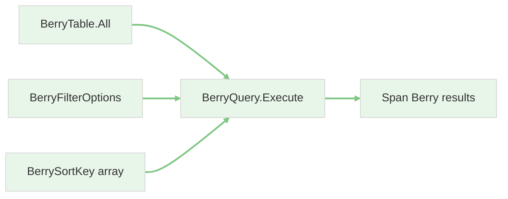
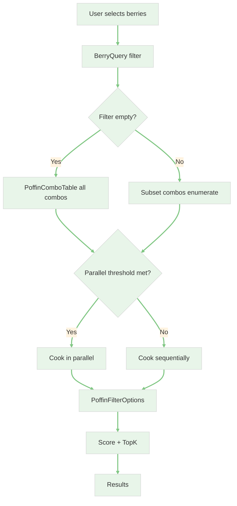
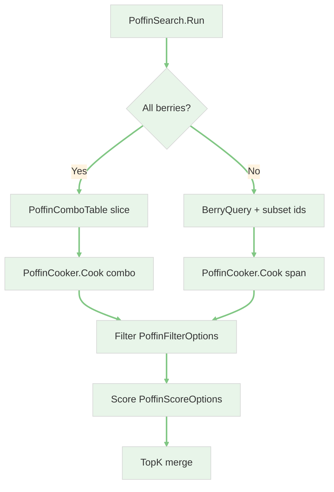
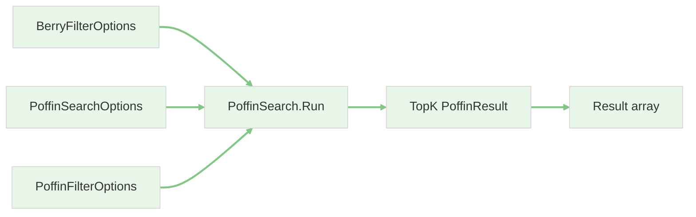

# API Flows

## Berry API Flow

```mermaid
%%{init: {'theme':'base', 'themeVariables': { 'primaryColor':'#e8f5e9','secondaryColor':'#fff3e0','tertiaryColor':'#e1f5fe', 'lineColor':'#81c784'}, 'themeCSS': '.flowchart-link { stroke-width: 2.5px !important; }'}}%%

flowchart LR
    A[BerryTable.All] --> B[BerryQuery.Execute]
    C[BerryFilterOptions] --> B
    D[BerrySortKey array] --> B
    B --> E[Span Berry results]
```

---

## Poffin Search Workflow

```mermaid
%%{init: {'theme':'base', 'themeVariables': { 'primaryColor':'#e8f5e9','secondaryColor':'#fff3e0','tertiaryColor':'#e1f5fe', 'lineColor':'#81c784'}, 'themeCSS': '.flowchart-link { stroke-width: 2.5px !important; }'}}%%

flowchart TD
    A[User selects berries] --> B[BerryQuery filter]
    B --> C{Filter empty?}
    C -->|Yes| D[PoffinComboTable all combos]
    C -->|No| E[Subset combos enumerate]
    D --> F{Parallel threshold met?}
    E --> F
    F -->|Yes| G[Cook in parallel]
    F -->|No| H[Cook sequentially]
    G --> I[PoffinFilterOptions]
    H --> I
    I --> J[Score + TopK]
    J --> K[Results]
```

---

## Internal Cooking Flow

```mermaid
%%{init: {'theme':'base', 'themeVariables': { 'primaryColor':'#e8f5e9','secondaryColor':'#fff3e0','tertiaryColor':'#e1f5fe', 'lineColor':'#81c784'}, 'themeCSS': '.flowchart-link { stroke-width: 2.5px !important; }'}}%%

flowchart TD
    A[PoffinSearch.Run] --> B{All berries?}
    B -->|Yes| C[PoffinComboTable slice]
    B -->|No| D[BerryQuery + subset ids]
    C --> E[PoffinCooker.Cook combo]
    D --> F[PoffinCooker.Cook span]
    E --> G[Filter PoffinFilterOptions]
    F --> G
    G --> H[Score PoffinScoreOptions]
    H --> I[TopK merge]
```

---

## High-Level API Flow

```mermaid
%%{init: {'theme':'base', 'themeVariables': { 'primaryColor':'#e8f5e9','secondaryColor':'#fff3e0','tertiaryColor':'#e1f5fe', 'lineColor':'#81c784'}, 'themeCSS': '.flowchart-link { stroke-width: 2.5px !important; }'}}%%

flowchart LR
    A[BerryFilterOptions] --> B[PoffinSearch.Run]
    C[PoffinSearchOptions] --> B
    D[PoffinFilterOptions] --> B
    B --> E[TopK PoffinResult]
    E --> F[Result array]
```

