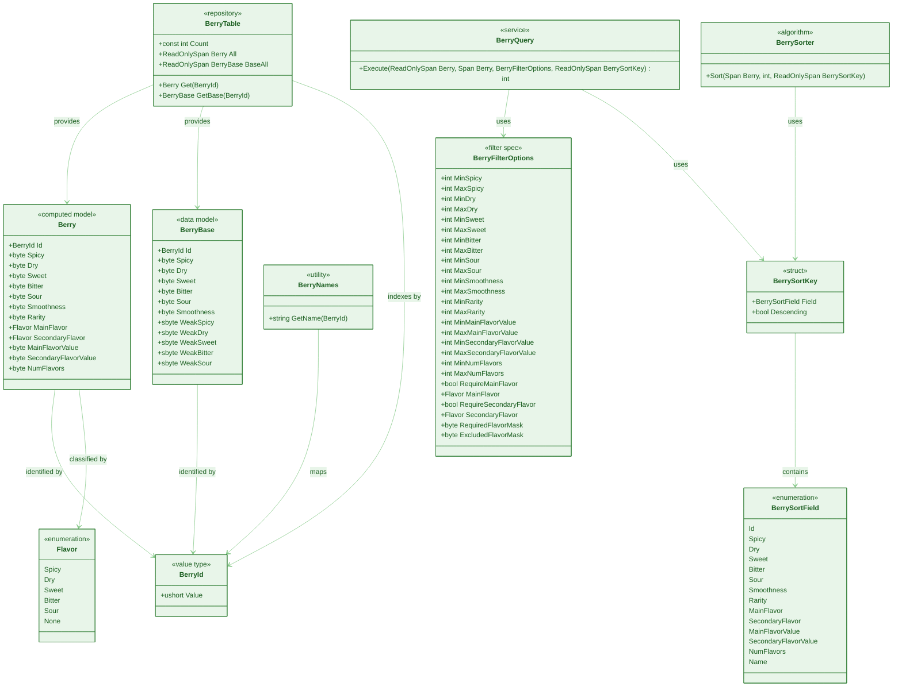

# Berry Class Diagram

```mermaid
%%{init: {"theme":"base", "themeVariables": { "primaryColor":"#e8f5e9","primaryTextColor":"#1b5e20","primaryBorderColor":"#2e7d32","lineColor":"#81c784","secondaryColor":"#fff3e0","tertiaryColor":"#e1f5fe"}, "themeCSS": ".relationshipLine { stroke-width: 2px !important; } .relationshipLabelBox { fill: #ffffff; }"}}%%

classDiagram
    direction TB

    class Flavor {
        <<enumeration>>
        Spicy
        Dry
        Sweet
        Bitter
        Sour
        None
    }
    class BerryId {
        <<value type>>
        +ushort Value
    }
    class BerryBase {
        <<data model>>
        +BerryId Id
        +byte Spicy
        +byte Dry
        +byte Sweet
        +byte Bitter
        +byte Sour
        +byte Smoothness
        +sbyte WeakSpicy
        +sbyte WeakDry
        +sbyte WeakSweet
        +sbyte WeakBitter
        +sbyte WeakSour
    }
    class Berry {
        <<computed model>>
        +BerryId Id
        +byte Spicy
        +byte Dry
        +byte Sweet
        +byte Bitter
        +byte Sour
        +byte Smoothness
        +byte Rarity
        +Flavor MainFlavor
        +Flavor SecondaryFlavor
        +byte MainFlavorValue
        +byte SecondaryFlavorValue
        +byte NumFlavors
    }
    class BerryTable {
        <<repository>>
        +const int Count
        +ReadOnlySpan Berry All
        +ReadOnlySpan BerryBase BaseAll
        +Berry Get(BerryId)
        +BerryBase GetBase(BerryId)
    }
    class BerryNames {
        <<utility>>
        +string GetName(BerryId)
    }
    class BerryFilterOptions {
        <<filter spec>>
        +int MinSpicy
        +int MaxSpicy
        +int MinDry
        +int MaxDry
        +int MinSweet
        +int MaxSweet
        +int MinBitter
        +int MaxBitter
        +int MinSour
        +int MaxSour
        +int MinSmoothness
        +int MaxSmoothness
        +int MinRarity
        +int MaxRarity
        +int MinMainFlavorValue
        +int MaxMainFlavorValue
        +int MinSecondaryFlavorValue
        +int MaxSecondaryFlavorValue
        +int MinNumFlavors
        +int MaxNumFlavors
        +bool RequireMainFlavor
        +Flavor MainFlavor
        +bool RequireSecondaryFlavor
        +Flavor SecondaryFlavor
        +byte RequiredFlavorMask
        +byte ExcludedFlavorMask
    }
    class BerrySortField {
        <<enumeration>>
        Id
        Spicy
        Dry
        Sweet
        Bitter
        Sour
        Smoothness
        Rarity
        MainFlavor
        SecondaryFlavor
        MainFlavorValue
        SecondaryFlavorValue
        NumFlavors
        Name
    }
    class BerrySortKey {
        <<struct>>
        +BerrySortField Field
        +bool Descending
    }
    class BerrySorter {
        <<algorithm>>
        +Sort(Span Berry, int, ReadOnlySpan BerrySortKey)
    }
    class BerryQuery {
        <<service>>
        +Execute(ReadOnlySpan Berry, Span Berry, BerryFilterOptions, ReadOnlySpan BerrySortKey) int
    }

    BerryTable --> Berry : provides
    BerryTable --> BerryBase : provides
    BerryTable --> BerryId : indexes by
    BerryNames --> BerryId : maps
    Berry --> BerryId : identified by
    Berry --> Flavor : classified by
    BerryBase --> BerryId : identified by

    BerryQuery --> BerryFilterOptions : uses
    BerryQuery --> BerrySortKey : uses
    BerrySorter --> BerrySortKey : uses
    BerrySortKey --> BerrySortField : contains
```

