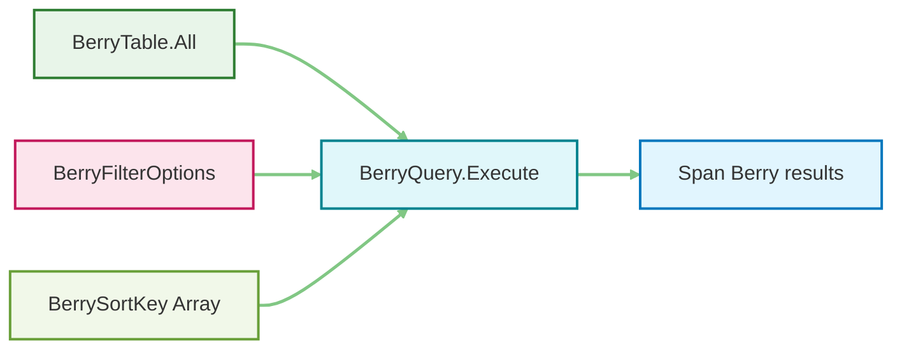
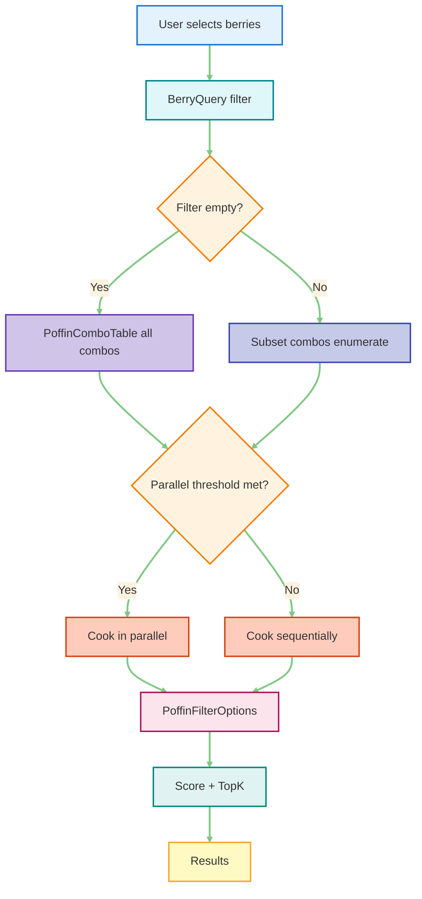
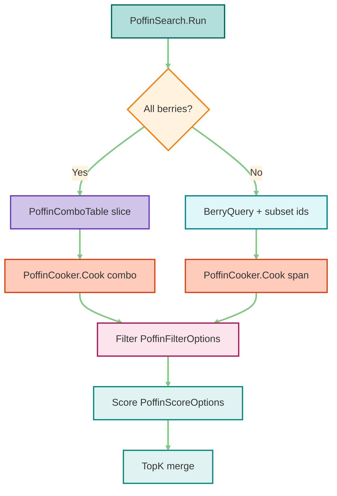
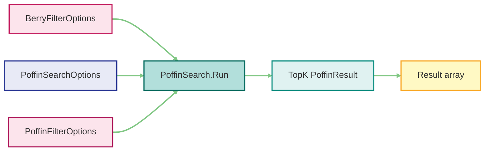

# Berry & Poffin System Architecture

## Overview

This document describes the architecture of the Berry and Poffin cooking system, including data models, filtering, sorting, and search capabilities.

---

## Class Diagram

```mermaid
%%{init: {"theme":"base", "themeVariables": { "primaryColor":"#e8f5e9","primaryTextColor":"#1b5e20","primaryBorderColor":"#2e7d32","lineColor":"#81c784","secondaryColor":"#fff3e0","tertiaryColor":"#e1f5fe"}, "themeCSS": ".relationshipLine { stroke-width: 2px !important; } .relationshipLabelBox { fill: #ffffff; }"}}%%

classDiagram
    direction TB

    class Flavor {
        <<enumeration>>
        Spicy
        Dry
        Sweet
        Bitter
        Sour
        None
    }
    style Flavor fill:#ffebee,stroke:#c62828,stroke-width:3px

    class BerryId {
        <<value type>>
        +ushort Value
    }
    style BerryId fill:#e8eaf6,stroke:#3f51b5,stroke-width:2px

    class BerryBase {
        <<data model>>
        +BerryId Id
        +byte Spicy
        +byte Dry
        +byte Sweet
        +byte Bitter
        +byte Sour
        +byte Smoothness
        +sbyte WeakSpicy
        +sbyte WeakDry
        +sbyte WeakSweet
        +sbyte WeakBitter
        +sbyte WeakSour
    }
    style BerryBase fill:#f3e5f5,stroke:#7b1fa2,stroke-width:2px

    class Berry {
        <<computed model>>
        +BerryId Id
        +byte Spicy
        +byte Dry
        +byte Sweet
        +byte Bitter
        +byte Sour
        +byte Smoothness
        +byte Rarity
        +Flavor MainFlavor
        +Flavor SecondaryFlavor
        +byte MainFlavorValue
        +byte SecondaryFlavorValue
        +byte NumFlavors
    }
    style Berry fill:#e1f5fe,stroke:#0277bd,stroke-width:3px

    class BerryTable {
        <<repository>>
        +const int Count
        +ReadOnlySpan Berry All
        +ReadOnlySpan BerryBase BaseAll
        +Berry Get(BerryId)
        +BerryBase GetBase(BerryId)
    }
    style BerryTable fill:#e8f5e9,stroke:#2e7d32,stroke-width:3px

    class BerryNames {
        <<utility>>
        +string GetName(BerryId)
    }
    style BerryNames fill:#fff3e0,stroke:#e65100,stroke-width:2px

    class BerryFilterOptions {
        <<filter spec>>
        +int MinSpicy
        +int MaxSpicy
        +int MinDry
        +int MaxDry
        +int MinSweet
        +int MaxSweet
        +int MinBitter
        +int MaxBitter
        +int MinSour
        +int MaxSour
        +int MinSmoothness
        +int MaxSmoothness
        +int MinRarity
        +int MaxRarity
        +int MinMainFlavorValue
        +int MaxMainFlavorValue
        +int MinSecondaryFlavorValue
        +int MaxSecondaryFlavorValue
        +int MinNumFlavors
        +int MaxNumFlavors
        +bool RequireMainFlavor
        +Flavor MainFlavor
        +bool RequireSecondaryFlavor
        +Flavor SecondaryFlavor
        +byte RequiredFlavorMask
        +byte ExcludedFlavorMask
    }
    style BerryFilterOptions fill:#fce4ec,stroke:#c2185b,stroke-width:2px

    class BerrySortField {
        <<enumeration>>
        Id
        Spicy
        Dry
        Sweet
        Bitter
        Sour
        Smoothness
        Rarity
        MainFlavor
        SecondaryFlavor
        MainFlavorValue
        SecondaryFlavorValue
        NumFlavors
        Name
    }
    style BerrySortField fill:#f1f8e9,stroke:#558b2f,stroke-width:2px

    class BerrySortKey {
        <<struct>>
        +BerrySortField Field
        +bool Descending
    }
    style BerrySortKey fill:#f1f8e9,stroke:#689f38,stroke-width:2px

    class BerrySorter {
        <<algorithm>>
        +Sort(Span Berry, int, ReadOnlySpan BerrySortKey)
    }
    style BerrySorter fill:#e0f2f1,stroke:#00695c,stroke-width:2px

    class BerryQuery {
        <<service>>
        +Execute(ReadOnlySpan Berry, Span Berry, BerryFilterOptions, ReadOnlySpan BerrySortKey) int
    }
    style BerryQuery fill:#e0f7fa,stroke:#00838f,stroke-width:3px

    class Poffin {
        <<product>>
        +byte Spicy
        +byte Dry
        +byte Sweet
        +byte Bitter
        +byte Sour
        +byte Smoothness
        +bool IsFoul
        +byte Level
        +byte SecondLevel
        +Flavor MainFlavor
        +Flavor SecondaryFlavor
        +byte NumFlavors
    }
    style Poffin fill:#fff9c4,stroke:#f57f17,stroke-width:3px

    class PoffinComboBase {
        <<precomputed>>
        +short WeakSpicySum
        +short WeakDrySum
        +short WeakSweetSum
        +short WeakBitterSum
        +short WeakSourSum
        +ushort SmoothnessSum
        +byte Count
    }
    style PoffinComboBase fill:#ede7f6,stroke:#512da8,stroke-width:2px

    class PoffinCooker {
        <<engine>>
        +Cook(ReadOnlySpan BerryBase, int, int, int, int) Poffin
        +Cook(PoffinComboBase, int, int, int, int) Poffin
    }
    style PoffinCooker fill:#ffccbc,stroke:#d84315,stroke-width:3px

    class PoffinComboTable {
        <<cache>>
        +int Count
        +ReadOnlySpan PoffinComboBase All
    }
    style PoffinComboTable fill:#d1c4e9,stroke:#673ab7,stroke-width:2px

    class PoffinComboEnumerator {
        <<generator>>
        +ForEach(ReadOnlySpan BerryId, int, Action)
    }
    style PoffinComboEnumerator fill:#c5cae9,stroke:#3949ab,stroke-width:2px

    class PoffinSearchOptions {
        <<configuration>>
        +int Choose
        +int CookTimeSeconds
        +int Spills
        +int Burns
        +int AmityBonus
        +bool UseParallel
        +int MaxDegreeOfParallelism
        +bool UseComboTableWhenAllBerries
    }
    style PoffinSearchOptions fill:#e8eaf6,stroke:#283593,stroke-width:2px

    class PoffinFilterOptions {
        <<filter spec>>
        +int MinSpicy
        +int MaxSpicy
        +int MinSmoothness
        +int MaxSmoothness
        +int MinLevel
        +int MaxLevel
    }
    style PoffinFilterOptions fill:#fce4ec,stroke:#ad1457,stroke-width:2px

    class PoffinResult {
        <<result>>
        +Poffin Poffin
        +int BerryCount
        +int Score
    }
    style PoffinResult fill:#fff9c4,stroke:#f9a825,stroke-width:3px

    class TopK {
        <<data structure>>
        +int Count
        +TryAdd(T, int)
    }
    style TopK fill:#e0f2f1,stroke:#00897b,stroke-width:2px

    class PoffinSearch {
        <<orchestrator>>
        +Run(BerryFilterOptions, PoffinSearchOptions, int, PoffinFilterOptions) PoffinResult[]
    }
    style PoffinSearch fill:#b2dfdb,stroke:#00695c,stroke-width:3px

    BerryTable --> Berry : provides
    BerryTable --> BerryBase : provides
    BerryTable --> BerryId : indexes by
    BerryNames --> BerryId : maps
    Berry --> BerryId : identified by
    Berry --> Flavor : classified by
    BerryBase --> BerryId : identified by

    BerryQuery --> BerryFilterOptions : uses
    BerryQuery --> BerrySortKey : uses
    BerrySorter --> BerrySortKey : uses
    BerrySortKey --> BerrySortField : contains

    PoffinCooker --> BerryBase : consumes
    PoffinCooker --> Poffin : produces
    PoffinCooker --> PoffinComboBase : can use
    Poffin --> Flavor : has

    PoffinComboTable --> PoffinComboBase : stores
    PoffinComboEnumerator --> BerryId : enumerates

    PoffinSearch --> PoffinSearchOptions : configured by
    PoffinSearch --> PoffinFilterOptions : filters with
    PoffinSearch --> PoffinResult : produces
    PoffinSearch --> TopK : ranks with
    PoffinSearch --> BerryFilterOptions : starts with
```

---

## Berry API Flow

---

## Poffin Search Workflow

---

## Internal Cooking Flow

---

## High-Level API Flow

---

## Color Legend

| Color | Component Type | Examples |
|-------|---------------|----------|
| **Red** | Enums & Filters | `Flavor`, `BerryFilterOptions`, `PoffinFilterOptions` |
| **Blue** | Core Data Models | `Berry`, `BerryId` |
| **Purple** | Raw Data & Precomputed | `BerryBase`, `PoffinComboBase`, `PoffinComboTable` |
| **Green** | Repositories & Services | `BerryTable`, `BerryQuery`, `PoffinSearch` |
| **Orange** | Cooking Engine | `PoffinCooker` |
| **Yellow** | Results & Products | `Poffin`, `PoffinResult` |
| **Teal** | Utilities & Data Structures | `TopK`, `BerrySorter` |

---

## Key Components

### Berry System
- **BerryTable**: Central repository providing access to all berry data
- **Berry**: Computed model with derived flavor properties
- **BerryBase**: Raw data used for cooking calculations
- **BerryQuery**: Filtering and sorting service

### Poffin System
- **PoffinCooker**: Core cooking engine with configurable parameters
- **PoffinComboTable**: Precomputed combinations for optimization
- **PoffinSearch**: Orchestrates the entire search and ranking process
- **TopK**: Efficient data structure for maintaining best results

### Optimization Strategy
The system uses a dual-path approach:
1. **All berries**: Uses precomputed `PoffinComboTable` for maximum speed
2. **Filtered berries**: Generates combinations on-demand via `PoffinComboEnumerator`