# Berry & Poffin System Architecture

## Overview

This document describes the architecture of the Berry and Poffin cooking system, including data models, filtering, sorting, and search capabilities.

---

## Class Diagram

---

## Poffin Search Workflow

```mermaid
%%{init: {'theme':'base', 'themeVariables': { 'primaryColor':'#e8f5e9','secondaryColor':'#fff3e0','tertiaryColor':'#e1f5fe'}}}%%

flowchart TD
    A[🎯 User selects berries] --> B{Berry filter<br/>applied?}
    B -->|No - All berries| C[💾 Use PoffinComboTable<br/>Precomputed]
    B -->|Yes - Subset| D[Enumerate subset combos]
    
    C --> E[Cook poffins]
    D --> E
    
    E --> F[🎯 Apply poffin filters]
    F --> G[📊 Score + TopK ranking]
    G --> H[✨ Results for UI]
    
    style A fill:#e3f2fd,stroke:#1976d2,stroke-width:2px
    style B fill:#fff3e0,stroke:#f57c00,stroke-width:2px
    style C fill:#e8f5e9,stroke:#388e3c,stroke-width:2px
    style D fill:#f3e5f5,stroke:#7b1fa2,stroke-width:2px
    style E fill:#fff9c4,stroke:#f57f17,stroke-width:3px
    style F fill:#fce4ec,stroke:#c2185b,stroke-width:2px
    style G fill:#e0f2f1,stroke:#00897b,stroke-width:2px
    style H fill:#c8e6c9,stroke:#388e3c,stroke-width:3px
```

---

## High-Level Search Flow

```mermaid
%%{init: {'theme':'base', 'themeVariables': { 'primaryColor':'#e8f5e9','secondaryColor':'#fff3e0','tertiaryColor':'#e1f5fe'}}}%%

flowchart LR
    A[🔍 Berry Filters<br/>BerryQuery] --> B[🎯 PoffinSearch.Run]
    
    B --> C{All berries<br/>selected?}
    
    C -->|Yes| D[💾 PoffinComboTable<br/>+ Cook]
    C -->|No| E[🔄 PoffinComboEnumerator<br/>+ Cook]
    
    D --> F[🏆 TopK ranked results]
    E --> F
    
    style A fill:#e0f7fa,stroke:#00838f,stroke-width:3px
    style B fill:#b2dfdb,stroke:#00695c,stroke-width:3px
    style C fill:#fff3e0,stroke:#f57c00,stroke-width:2px
    style D fill:#d1c4e9,stroke:#673ab7,stroke-width:2px
    style E fill:#c5cae9,stroke:#3949ab,stroke-width:2px
    style F fill:#fff9c4,stroke:#f9a825,stroke-width:3px
```

---

## Color Legend

| Color | Component Type | Examples |
|-------|---------------|----------|
| 🔴 **Red** | Enums & Filters | `Flavor`, `BerryFilterOptions`, `PoffinFilterOptions` |
| 🔵 **Blue** | Core Data Models | `Berry`, `BerryId` |
| 🟣 **Purple** | Raw Data & Precomputed | `BerryBase`, `PoffinComboBase`, `PoffinComboTable` |
| 🟢 **Green** | Repositories & Services | `BerryTable`, `BerryQuery`, `PoffinSearch` |
| 🟠 **Orange** | Cooking Engine | `PoffinCooker` |
| 🟡 **Yellow** | Results & Products | `Poffin`, `PoffinResult` |
| ⚪ **Teal** | Utilities & Data Structures | `TopK`, `BerrySorter` |

---

## Key Components

### Berry System
- **BerryTable**: Central repository providing access to all berry data
- **Berry**: Computed model with derived flavor properties
- **BerryBase**: Raw data used for cooking calculations
- **BerryQuery**: Filtering and sorting service

### Poffin System
- **PoffinCooker**: Core cooking engine with configurable parameters
- **PoffinComboTable**: Precomputed combinations for optimization
- **PoffinSearch**: Orchestrates the entire search and ranking process
- **TopK**: Efficient data structure for maintaining best results

### Optimization Strategy
The system uses a dual-path approach:
1. **All berries**: Uses precomputed `PoffinComboTable` for maximum speed
2. **Filtered berries**: Generates combinations on-demand via `PoffinComboEnumerator`
