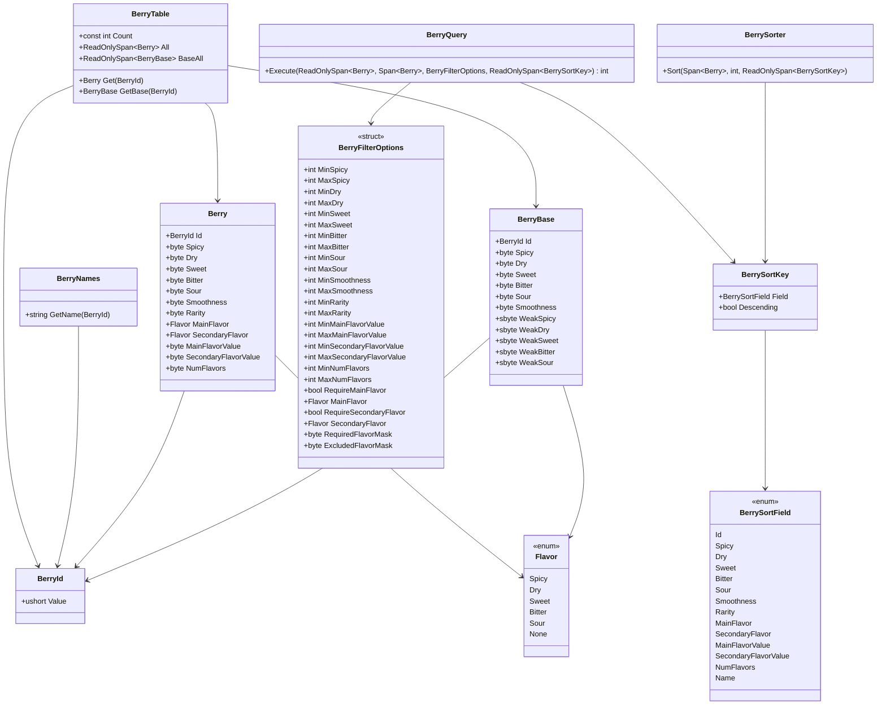
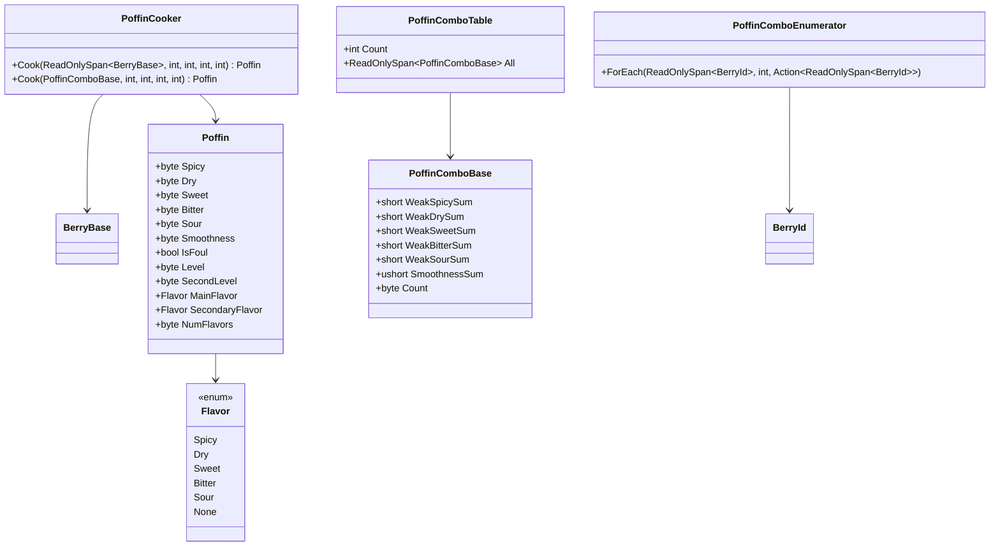

# Berry Class Diagram

```mermaid
classDiagram
    class Flavor {
        <<enum>>
        Spicy
        Dry
        Sweet
        Bitter
        Sour
        None
    }

    class BerryId {
        +ushort Value
    }

    class BerryBase {
        +BerryId Id
        +byte Spicy
        +byte Dry
        +byte Sweet
        +byte Bitter
        +byte Sour
        +byte Smoothness
        +sbyte WeakSpicy
        +sbyte WeakDry
        +sbyte WeakSweet
        +sbyte WeakBitter
        +sbyte WeakSour
    }

    class Berry {
        +BerryId Id
        +byte Spicy
        +byte Dry
        +byte Sweet
        +byte Bitter
        +byte Sour
        +byte Smoothness
        +byte Rarity
        +Flavor MainFlavor
        +Flavor SecondaryFlavor
        +byte MainFlavorValue
        +byte SecondaryFlavorValue
        +byte NumFlavors
    }

    class BerryTable {
        +const int Count
        +ReadOnlySpan~Berry~ All
        +ReadOnlySpan~BerryBase~ BaseAll
        +Berry Get(BerryId)
        +BerryBase GetBase(BerryId)
    }

    class BerryNames {
        +string GetName(BerryId)
    }

    class BerryFilterOptions {
        <<struct>>
        +int MinSpicy
        +int MaxSpicy
        +int MinDry
        +int MaxDry
        +int MinSweet
        +int MaxSweet
        +int MinBitter
        +int MaxBitter
        +int MinSour
        +int MaxSour
        +int MinSmoothness
        +int MaxSmoothness
        +int MinRarity
        +int MaxRarity
        +int MinMainFlavorValue
        +int MaxMainFlavorValue
        +int MinSecondaryFlavorValue
        +int MaxSecondaryFlavorValue
        +int MinNumFlavors
        +int MaxNumFlavors
        +bool RequireMainFlavor
        +Flavor MainFlavor
        +bool RequireSecondaryFlavor
        +Flavor SecondaryFlavor
        +byte RequiredFlavorMask
        +byte ExcludedFlavorMask
    }

    class BerrySortField {
        <<enum>>
        Id
        Spicy
        Dry
        Sweet
        Bitter
        Sour
        Smoothness
        Rarity
        MainFlavor
        SecondaryFlavor
        MainFlavorValue
        SecondaryFlavorValue
        NumFlavors
        Name
    }

    class BerrySortKey {
        +BerrySortField Field
        +bool Descending
    }

    class BerrySorter {
        +Sort(Span~Berry~, int, ReadOnlySpan~BerrySortKey~)
    }

    class BerryQuery {
        +Execute(ReadOnlySpan~Berry~, Span~Berry~, BerryFilterOptions, ReadOnlySpan~BerrySortKey~) int
    }

    BerryTable --> Berry
    BerryTable --> BerryBase
    BerryTable --> BerryId
    BerryNames --> BerryId
    Berry --> BerryId
    Berry --> Flavor
    BerryBase --> BerryId
    BerryBase --> Flavor
    BerryQuery --> BerryFilterOptions
    BerryQuery --> BerrySortKey
    BerrySorter --> BerrySortKey
    BerrySortKey --> BerrySortField
```

# Poffin / Cooking Diagram

```mermaid
classDiagram
    class Flavor {
        <<enum>>
        Spicy
        Dry
        Sweet
        Bitter
        Sour
        None
    }

    class Poffin {
        +byte Spicy
        +byte Dry
        +byte Sweet
        +byte Bitter
        +byte Sour
        +byte Smoothness
        +bool IsFoul
        +byte Level
        +byte SecondLevel
        +Flavor MainFlavor
        +Flavor SecondaryFlavor
        +byte NumFlavors
    }

    class PoffinCooker {
        +Cook(ReadOnlySpan~BerryBase~, int, int, int, int) Poffin
        +Cook(PoffinComboBase, int, int, int, int) Poffin
    }

    class PoffinComboBase {
        +short WeakSpicySum
        +short WeakDrySum
        +short WeakSweetSum
        +short WeakBitterSum
        +short WeakSourSum
        +ushort SmoothnessSum
        +byte Count
    }

    class PoffinComboTable {
        +int Count
        +ReadOnlySpan~PoffinComboBase~ All
    }

    class PoffinComboEnumerator {
        +ForEach(ReadOnlySpan~BerryId~, int, Action~ReadOnlySpan~BerryId~~)
    }

    PoffinCooker --> BerryBase
    PoffinCooker --> Poffin
    Poffin --> Flavor
    PoffinComboTable --> PoffinComboBase
    PoffinComboEnumerator --> BerryId
```
