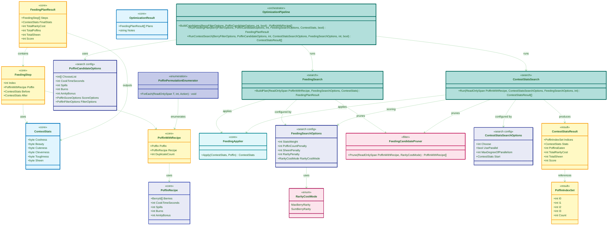

# Optimization Class Diagram

```mermaid
%%{init: {"theme":"base", "themeVariables": { "primaryColor":"#e8f5e9","primaryTextColor":"#1b5e20","primaryBorderColor":"#2e7d32","lineColor":"#81c784","secondaryColor":"#fff3e0","tertiaryColor":"#e1f5fe"}, "themeCSS": ".relationshipLine { stroke-width: 2px !important; } .relationshipLabelBox { fill: #ffffff; }"}}%%

classDiagram
    direction TB

    class ContestStats {
        <<core>>
        +byte Coolness
        +byte Beauty
        +byte Cuteness
        +byte Cleverness
        +byte Toughness
        +byte Sheen
    }
    style ContestStats fill:#e1f5fe,stroke:#0277bd,stroke-width:3px

    class PoffinRecipe {
        <<core>>
        +BerryId[] Berries
        +int CookTimeSeconds
        +int Spills
        +int Burns
        +int AmityBonus
    }
    style PoffinRecipe fill:#e8eaf6,stroke:#3f51b5,stroke-width:2px

    class PoffinWithRecipe {
        <<core>>
        +Poffin Poffin
        +PoffinRecipe Recipe
        +int DuplicateCount
    }
    style PoffinWithRecipe fill:#fff9c4,stroke:#f9a825,stroke-width:2px

    class FeedingStep {
        <<core>>
        +int Index
        +PoffinWithRecipe Poffin
        +ContestStats Before
        +ContestStats After
    }
    style FeedingStep fill:#fff9c4,stroke:#f9a825,stroke-width:2px

    class FeedingPlanResult {
        <<core>>
        +FeedingStep[] Steps
        +ContestStats FinalStats
        +int TotalRarityCost
        +int TotalPoffins
        +int TotalSheen
        +int Score
    }
    style FeedingPlanResult fill:#fff9c4,stroke:#f9a825,stroke-width:3px

    class OptimizationResult {
        <<core>>
        +FeedingPlanResult[] Plans
        +string Notes
    }
    style OptimizationResult fill:#e1f5fe,stroke:#0277bd,stroke-width:2px

    class FeedingApplier {
        <<core>>
        +Apply(ContestStats, Poffin) ContestStats
    }
    style FeedingApplier fill:#e0f7fa,stroke:#00838f,stroke-width:2px

    class RarityCostMode {
        <<enum>>
        MaxBerryRarity
        SumBerryRarity
    }
    style RarityCostMode fill:#fce4ec,stroke:#ad1457,stroke-width:2px

    class FeedingSearchOptions {
        <<search config>>
        +int StatsWeight
        +int PoffinCountPenalty
        +int SheenPenalty
        +int RarityPenalty
        +RarityCostMode RarityCostMode
    }
    style FeedingSearchOptions fill:#e8eaf6,stroke:#283593,stroke-width:2px

    class PoffinCandidateOptions {
        <<search config>>
        +int[] ChooseList
        +int CookTimeSeconds
        +int Spills
        +int Burns
        +int AmityBonus
        +PoffinScoreOptions ScoreOptions
        +PoffinFilterOptions FilterOptions
    }
    style PoffinCandidateOptions fill:#e8eaf6,stroke:#283593,stroke-width:2px

    class FeedingCandidatePruner {
        <<filter>>
        +Prune(ReadOnlySpan PoffinWithRecipe, RarityCostMode) PoffinWithRecipe[]
    }
    style FeedingCandidatePruner fill:#fce4ec,stroke:#c2185b,stroke-width:2px

    class FeedingSearch {
        <<search>>
        +BuildPlan(ReadOnlySpan PoffinWithRecipe, FeedingSearchOptions, ContestStats) FeedingPlanResult
    }
    style FeedingSearch fill:#b2dfdb,stroke:#00695c,stroke-width:3px

    class ContestStatsSearchOptions {
        <<search config>>
        +int Choose
        +bool UseParallel
        +int MaxDegreeOfParallelism
        +ContestStats Start
    }
    style ContestStatsSearchOptions fill:#e8eaf6,stroke:#283593,stroke-width:2px

    class ContestStatsResult {
        <<result>>
        +PoffinIndexSet Indices
        +ContestStats Stats
        +int PoffinsEaten
        +int TotalRarityCost
        +int TotalSheen
        +int Score
    }
    style ContestStatsResult fill:#fff9c4,stroke:#f9a825,stroke-width:3px

    class PoffinIndexSet {
        <<result>>
        +int I0
        +int I1
        +int I2
        +int I3
        +int Count
    }
    style PoffinIndexSet fill:#fff9c4,stroke:#f9a825,stroke-width:2px

    class ContestStatsSearch {
        <<search>>
        +Run(ReadOnlySpan PoffinWithRecipe, ContestStatsSearchOptions, FeedingSearchOptions, int) ContestStatsResult[]
    }
    style ContestStatsSearch fill:#b2dfdb,stroke:#00695c,stroke-width:3px

    class OptimizationPipeline {
        <<orchestrator>>
        +BuildCandidates(BerryFilterOptions, PoffinCandidateOptions, int, bool) PoffinWithRecipe[]
        +RunFeedingPlan(BerryFilterOptions, PoffinCandidateOptions, int, FeedingSearchOptions, ContestStats, bool) FeedingPlanResult
        +RunContestSearch(BerryFilterOptions, PoffinCandidateOptions, int, ContestStatsSearchOptions, FeedingSearchOptions, int, bool) ContestStatsResult[]
    }
    style OptimizationPipeline fill:#b2dfdb,stroke:#00695c,stroke-width:3px

    class PoffinPermutationEnumerator {
        <<enumeration>>
        +ForEach(ReadOnlySpan T, int, Action) void
    }
    style PoffinPermutationEnumerator fill:#c5cae9,stroke:#3949ab,stroke-width:2px

    PoffinWithRecipe --> PoffinRecipe : uses
    FeedingStep --> PoffinWithRecipe : uses
    FeedingStep --> ContestStats : uses
    FeedingPlanResult --> FeedingStep : contains
    FeedingPlanResult --> ContestStats : outputs
    FeedingSearch --> FeedingCandidatePruner : prunes
    FeedingSearch --> FeedingApplier : applies
    FeedingSearch --> FeedingSearchOptions : configured by
    FeedingSearchOptions --> RarityCostMode : uses

    ContestStatsSearch --> FeedingCandidatePruner : prunes
    ContestStatsSearch --> FeedingApplier : applies
    ContestStatsSearch --> ContestStatsSearchOptions : configured by
    ContestStatsSearch --> FeedingSearchOptions : scoring
    ContestStatsSearch --> ContestStatsResult : produces
    ContestStatsResult --> PoffinIndexSet : references

    PoffinPermutationEnumerator --> PoffinWithRecipe : enumerates
    OptimizationPipeline --> PoffinCandidateOptions : uses
    OptimizationPipeline --> FeedingSearch : runs
    OptimizationPipeline --> ContestStatsSearch : runs
```
