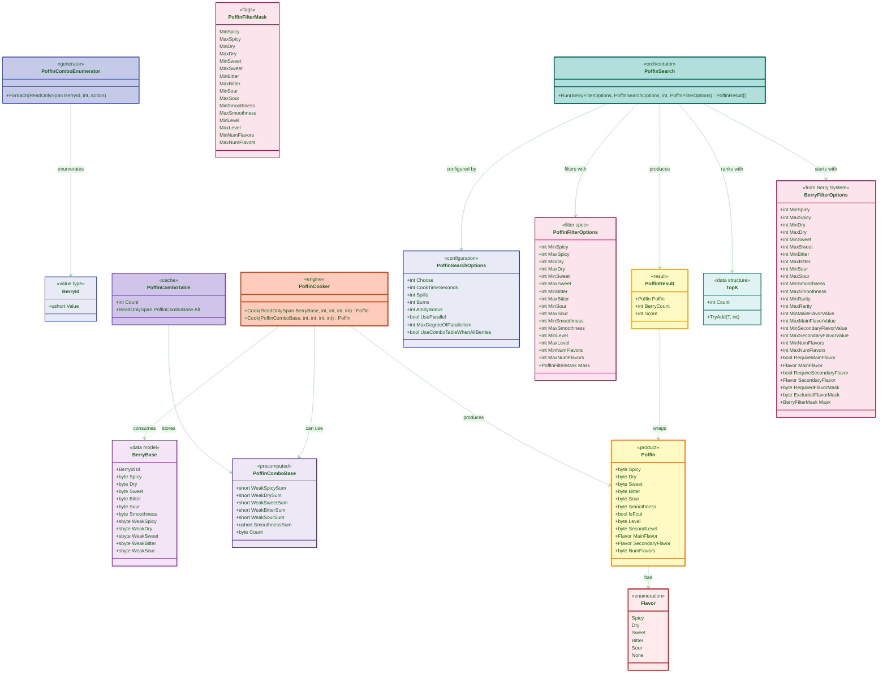

# Poffin Class Diagram

```mermaid
%%{init: {"theme":"base", "themeVariables": { "primaryColor":"#e8f5e9","primaryTextColor":"#1b5e20","primaryBorderColor":"#2e7d32","lineColor":"#81c784","secondaryColor":"#fff3e0","tertiaryColor":"#e1f5fe"}, "themeCSS": ".relationshipLine { stroke-width: 2px !important; } .relationshipLabelBox { fill: #ffffff; }"}}%%

classDiagram
    direction TB

 class Flavor {
        <<enumeration>>
        Spicy
        Dry
        Sweet
        Bitter
        Sour
        None
    }
    style Flavor fill:#ffebee,stroke:#c62828,stroke-width:3px

    class BerryId {
        <<value type>>
        +ushort Value
    }
    style BerryId fill:#e8eaf6,stroke:#3f51b5,stroke-width:2px

    class BerryBase {
        <<data model>>
        +BerryId Id
        +byte Spicy
        +byte Dry
        +byte Sweet
        +byte Bitter
        +byte Sour
        +byte Smoothness
        +sbyte WeakSpicy
        +sbyte WeakDry
        +sbyte WeakSweet
        +sbyte WeakBitter
        +sbyte WeakSour
    }
    style BerryBase fill:#f3e5f5,stroke:#7b1fa2,stroke-width:2px

 class PoffinComboBase {
        <<precomputed>>
        +short WeakSpicySum
        +short WeakDrySum
        +short WeakSweetSum
        +short WeakBitterSum
        +short WeakSourSum
        +ushort SmoothnessSum
        +byte Count
    }
    style PoffinComboBase fill:#ede7f6,stroke:#512da8,stroke-width:2px

    class PoffinComboTable {
        <<cache>>
        +int Count
        +ReadOnlySpan PoffinComboBase All
    }
    style PoffinComboTable fill:#d1c4e9,stroke:#673ab7,stroke-width:2px

    class PoffinComboEnumerator {
        <<generator>>
        +ForEach(ReadOnlySpan BerryId, int, Action)
    }
    style PoffinComboEnumerator fill:#c5cae9,stroke:#3949ab,stroke-width:2px

    class PoffinCooker {
        <<engine>>
        +Cook(ReadOnlySpan BerryBase, int, int, int, int) Poffin
        +Cook(PoffinComboBase, int, int, int, int) Poffin
    }
    style PoffinCooker fill:#ffccbc,stroke:#d84315,stroke-width:3px

    class Poffin {
        <<product>>
        +byte Spicy
        +byte Dry
        +byte Sweet
        +byte Bitter
        +byte Sour
        +byte Smoothness
        +bool IsFoul
        +byte Level
        +byte SecondLevel
        +Flavor MainFlavor
        +Flavor SecondaryFlavor
        +byte NumFlavors
    }
    style Poffin fill:#fff9c4,stroke:#f57f17,stroke-width:3px

    class PoffinSearchOptions {
        <<configuration>>
        +int Choose
        +int CookTimeSeconds
        +int Spills
        +int Burns
        +int AmityBonus
        +bool UseParallel
        +int MaxDegreeOfParallelism
        +bool UseComboTableWhenAllBerries
    }
    style PoffinSearchOptions fill:#e8eaf6,stroke:#283593,stroke-width:2px

    class PoffinFilterOptions {
        <<filter spec>>
        +int MinSpicy
        +int MaxSpicy
        +int MinDry
        +int MaxDry
        +int MinSweet
        +int MaxSweet
        +int MinBitter
        +int MaxBitter
        +int MinSour
        +int MaxSour
        +int MinSmoothness
        +int MaxSmoothness
        +int MinLevel
        +int MaxLevel
        +int MinNumFlavors
        +int MaxNumFlavors
        +PoffinFilterMask Mask
    }
    style PoffinFilterOptions fill:#fce4ec,stroke:#ad1457,stroke-width:2px

    class PoffinFilterMask {
        <<flags>>
        MinSpicy
        MaxSpicy
        MinDry
        MaxDry
        MinSweet
        MaxSweet
        MinBitter
        MaxBitter
        MinSour
        MaxSour
        MinSmoothness
        MaxSmoothness
        MinLevel
        MaxLevel
        MinNumFlavors
        MaxNumFlavors
    }
    style PoffinFilterMask fill:#fce4ec,stroke:#ad1457,stroke-width:2px

    class PoffinResult {
        <<result>>
        +Poffin Poffin
        +int BerryCount
        +int Score
    }
    style PoffinResult fill:#fff9c4,stroke:#f9a825,stroke-width:3px

    class TopK {
        <<data structure>>
        +int Count
        +TryAdd(T, int)
    }
    style TopK fill:#e0f2f1,stroke:#00897b,stroke-width:2px

    class PoffinSearch {
        <<orchestrator>>
        +Run(BerryFilterOptions, PoffinSearchOptions, int, PoffinFilterOptions) PoffinResult[]
    }
    style PoffinSearch fill:#b2dfdb,stroke:#00695c,stroke-width:3px

    class BerryFilterOptions {
        <<from Berry System>>
        +int MinSpicy
        +int MaxSpicy
        +int MinDry
        +int MaxDry
        +int MinSweet
        +int MaxSweet
        +int MinBitter
        +int MaxBitter
        +int MinSour
        +int MaxSour
        +int MinSmoothness
        +int MaxSmoothness
        +int MinRarity
        +int MaxRarity
        +int MinMainFlavorValue
        +int MaxMainFlavorValue
        +int MinSecondaryFlavorValue
        +int MaxSecondaryFlavorValue
        +int MinNumFlavors
        +int MaxNumFlavors
        +bool RequireMainFlavor
        +Flavor MainFlavor
        +bool RequireSecondaryFlavor
        +Flavor SecondaryFlavor
        +byte RequiredFlavorMask
        +byte ExcludedFlavorMask
        +BerryFilterMask Mask
    }
    style BerryFilterOptions fill:#fce4ec,stroke:#c2185b,stroke-width:2px


    PoffinComboTable --> PoffinComboBase : stores
    PoffinComboEnumerator --> BerryId : enumerates
    PoffinCooker --> BerryBase : consumes
    PoffinCooker --> PoffinComboBase : can use
    PoffinCooker --> Poffin : produces
    Poffin --> Flavor : has

    PoffinSearch --> PoffinSearchOptions : configured by
    PoffinSearch --> PoffinFilterOptions : filters with
    PoffinSearch --> PoffinResult : produces
    PoffinSearch --> TopK : ranks with
    PoffinSearch --> BerryFilterOptions : starts with
    PoffinResult --> Poffin : wraps
```

