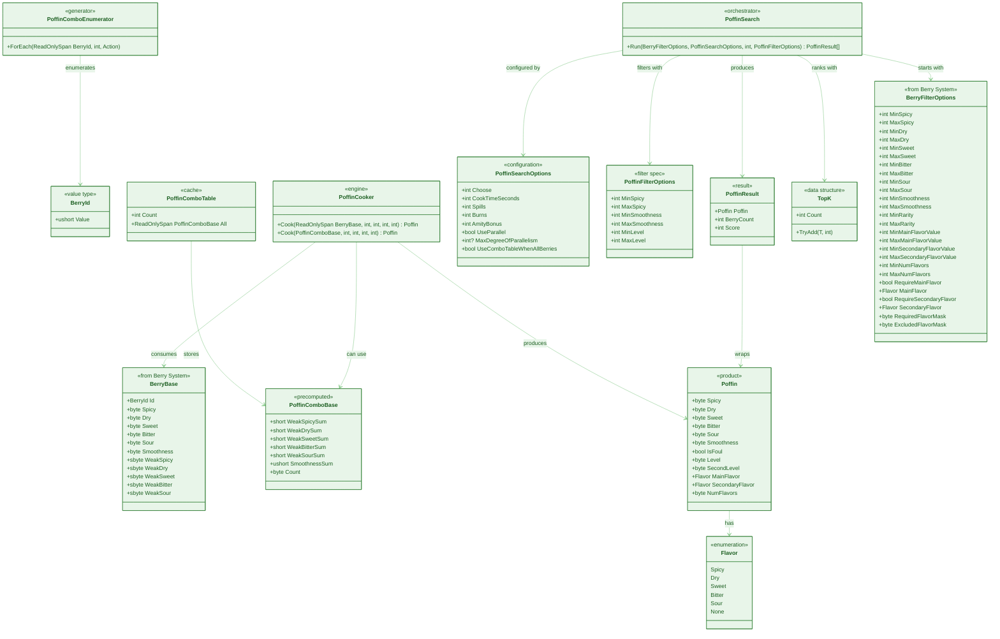

# Poffin Class Diagram

```mermaid
%%{init: {"theme":"base", "themeVariables": { "primaryColor":"#e8f5e9","primaryTextColor":"#1b5e20","primaryBorderColor":"#2e7d32","lineColor":"#81c784","secondaryColor":"#fff3e0","tertiaryColor":"#e1f5fe"}, "themeCSS": ".relationshipLine { stroke-width: 2px !important; } .relationshipLabelBox { fill: #ffffff; }"}}%%

classDiagram
    direction TB

    class Flavor {
        <<enumeration>>
        Spicy
        Dry
        Sweet
        Bitter
        Sour
        None
    }
    class BerryId {
        <<value type>>
        +ushort Value
    }
    class BerryBase {
        <<from Berry System>>
        +BerryId Id
        +byte Spicy
        +byte Dry
        +byte Sweet
        +byte Bitter
        +byte Sour
        +byte Smoothness
        +sbyte WeakSpicy
        +sbyte WeakDry
        +sbyte WeakSweet
        +sbyte WeakBitter
        +sbyte WeakSour
    }

    class PoffinComboBase {
        <<precomputed>>
        +short WeakSpicySum
        +short WeakDrySum
        +short WeakSweetSum
        +short WeakBitterSum
        +short WeakSourSum
        +ushort SmoothnessSum
        +byte Count
    }
    class PoffinComboTable {
        <<cache>>
        +int Count
        +ReadOnlySpan PoffinComboBase All
    }
    class PoffinComboEnumerator {
        <<generator>>
        +ForEach(ReadOnlySpan BerryId, int, Action)
    }
    class PoffinCooker {
        <<engine>>
        +Cook(ReadOnlySpan BerryBase, int, int, int, int) Poffin
        +Cook(PoffinComboBase, int, int, int, int) Poffin
    }

    class Poffin {
        <<product>>
        +byte Spicy
        +byte Dry
        +byte Sweet
        +byte Bitter
        +byte Sour
        +byte Smoothness
        +bool IsFoul
        +byte Level
        +byte SecondLevel
        +Flavor MainFlavor
        +Flavor SecondaryFlavor
        +byte NumFlavors
    }

    class PoffinSearchOptions {
        <<configuration>>
        +int Choose
        +int CookTimeSeconds
        +int Spills
        +int Burns
        +int AmityBonus
        +bool UseParallel
        +int? MaxDegreeOfParallelism
        +bool UseComboTableWhenAllBerries
    }
    class PoffinFilterOptions {
        <<filter spec>>
        +int MinSpicy
        +int MaxSpicy
        +int MinSmoothness
        +int MaxSmoothness
        +int MinLevel
        +int MaxLevel
    }
    class PoffinResult {
        <<result>>
        +Poffin Poffin
        +int BerryCount
        +int Score
    }
    class TopK {
        <<data structure>>
        +int Count
        +TryAdd(T, int)
    }
    class PoffinSearch {
        <<orchestrator>>
        +Run(BerryFilterOptions, PoffinSearchOptions, int, PoffinFilterOptions) PoffinResult[]
    }
    class BerryFilterOptions {
        <<from Berry System>>
        +int MinSpicy
        +int MaxSpicy
        +int MinDry
        +int MaxDry
        +int MinSweet
        +int MaxSweet
        +int MinBitter
        +int MaxBitter
        +int MinSour
        +int MaxSour
        +int MinSmoothness
        +int MaxSmoothness
        +int MinRarity
        +int MaxRarity
        +int MinMainFlavorValue
        +int MaxMainFlavorValue
        +int MinSecondaryFlavorValue
        +int MaxSecondaryFlavorValue
        +int MinNumFlavors
        +int MaxNumFlavors
        +bool RequireMainFlavor
        +Flavor MainFlavor
        +bool RequireSecondaryFlavor
        +Flavor SecondaryFlavor
        +byte RequiredFlavorMask
        +byte ExcludedFlavorMask
    }

    PoffinComboTable --> PoffinComboBase : stores
    PoffinComboEnumerator --> BerryId : enumerates
    PoffinCooker --> BerryBase : consumes
    PoffinCooker --> PoffinComboBase : can use
    PoffinCooker --> Poffin : produces
    Poffin --> Flavor : has

    PoffinSearch --> PoffinSearchOptions : configured by
    PoffinSearch --> PoffinFilterOptions : filters with
    PoffinSearch --> PoffinResult : produces
    PoffinSearch --> TopK : ranks with
    PoffinSearch --> BerryFilterOptions : starts with
    PoffinResult --> Poffin : wraps
```

